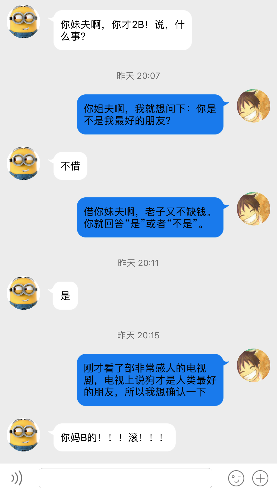

## Socket

```
/**
         *1.创建客户端socket
         *参数1：协议域 遵守的IP协议类型 AF_INET：IPv4  AF_INET6：IPv6
         *参数2：端口类型 TCP：SOCK_STREAM  UDP：SOCK_DGRAM
         *参数3：选择的协议类型 一般传0 根据第二个参数自动选择
         *返回值：返回值>0,表示socket创建成功
         */
        int socketNum = socket(AF_INET, SOCK_STREAM, 0);
        NSLog(@"%d",socketNum);
        
        //2.创建服务器端socket
        struct sockaddr_in serverAddress;
        //设置服务器socket遵循的IP协议类型
        serverAddress.sin_family = AF_INET;
        //服务器socket的IP地址
        serverAddress.sin_addr.s_addr = inet_addr("192.168.31.104");
        //设置服务器端口号，端口号最大值65535，09~1024是系统默认占用的端口号不要设置
        //如果需要手动设置端口号,一般设置1024~65535之间的值
        serverAddress.sin_port = htons(12345);
        
        /**
         *3.连接两个socket
         *参数1：客户端socket
         *参数2：服务器端socket
         *参数3：第二个参数的长度
         *返回值：返回值为0，表示连接成功 ;想要连接成功，就必须实时监测服务器的端口 检测服务器端口:nc -lk 12345
         */
        int conn = connect(socketNum, (const struct sockaddr *)&serverAddress, sizeof(serverAddress));
        NSLog(@"%d",conn);
        
        // 4. 发送信息给服务器
        // 参数1: 客户端 Socket
        // 参数2: void * 传递给服务器的数据!  msg.UTF8String 就是直接将 OC 数据转换成 C 语言的数据类型!
        // 参数3: size_t 锁传递给服务器数据的长度!
        // 参数4: 传0 等待服务器响应数据!
        
        NSString *msg=textField.text;
        [self sendMessage:msg type:JDMessageTypeSelf];
        textField.text = @"";
        send(socketNum, msg.UTF8String, strlen(msg.UTF8String), 0);
        
        dispatch_queue_t serialQueue = dispatch_queue_create("seriallQueue", DISPATCH_QUEUE_SERIAL);
        dispatch_async(serialQueue, ^{
            
            // 5.接受服务器返回的数据!
            // 参数1:客户端 Socket :服务器确定返回给哪一个客户端数据.
            // 参数2:void * :接收服务器返回数据的地址(区域)
            // 参数3:size_t :接受地址的长度
            // 参数4:传0 等待服务器返回数据!
            // 返回值: 就是服务器返回的数据长度!
            
            ssize_t buffer[1024];
            
            ssize_t length = recv(socketNum, buffer,sizeof(buffer), 0);
            
            // 获得服务器返回的数据(从 buffer 中取出需要的数据)
            
            // 根据二进制数据,拼接字符串
            // Bytes: 网络中传递的数据流(比特流/字节)
            NSString *returnMsg = [[NSString alloc] initWithBytes:buffer length:length encoding:NSUTF8StringEncoding];
            
            [self sendMessage:returnMsg type:JDMessageTypeOther];
            NSLog(@"returnMsg:%@",returnMsg);
            
            // 6.一个请求结束之后(接收到响应之后),需要手动关闭Socket!
            close(socketNum);
        });
```

## OverView



## License

Released under the MIT license. See LICENSE for details.